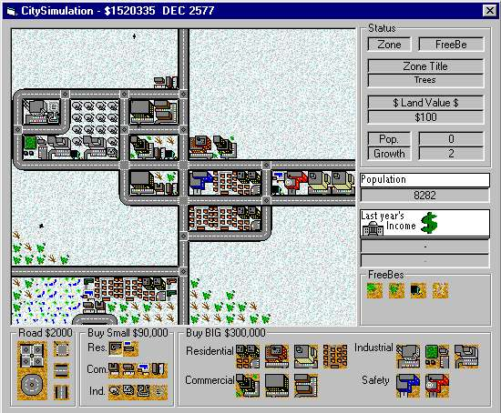



## City Simulator \- partial

### Description

I wanted to emulate one of my favorite games the best i could. It has a few unique features like birds freely flying around the city(animated), sometimes they seem to flock (but the biod system isn't too advanced, they see other birds and objective-points but not buildings). IF ANYONE CAN COME UP WITH A GOOD CITY GROWTH MODEL PLEASE HELP. The current city growth is based on a crappy crime equation i came up with. (Crime = (PopCount / 4) - (2 * SafetyCount))
 
### More Info
 

             |
---                |---
**Submitted On**   |2000-09-03 05:54:40
**By**             |[Dave Katrowski](https://github.com/Planet-Source-Code/PSCIndex/blob/master/ByAuthor/dave-katrowski.md)
**Level**          |Intermediate
**User Rating**    |4.5 (104 globes from 23 users)
**Compatibility**  |VB 4\.0 \(32\-bit\), VB 5\.0, VB 6\.0
**Category**       |[Games](https://github.com/Planet-Source-Code/PSCIndex/blob/master/ByCategory/games__1-38.md)
**World**          |[Visual Basic](https://github.com/Planet-Source-Code/PSCIndex/blob/master/ByWorld/visual-basic.md)
**Archive File**   |[CODE\_UPLOAD9567932000\.zip](https://github.com/Planet-Source-Code/dave-katrowski-city-simulator-partial__1-11216/archive/master.zip)

